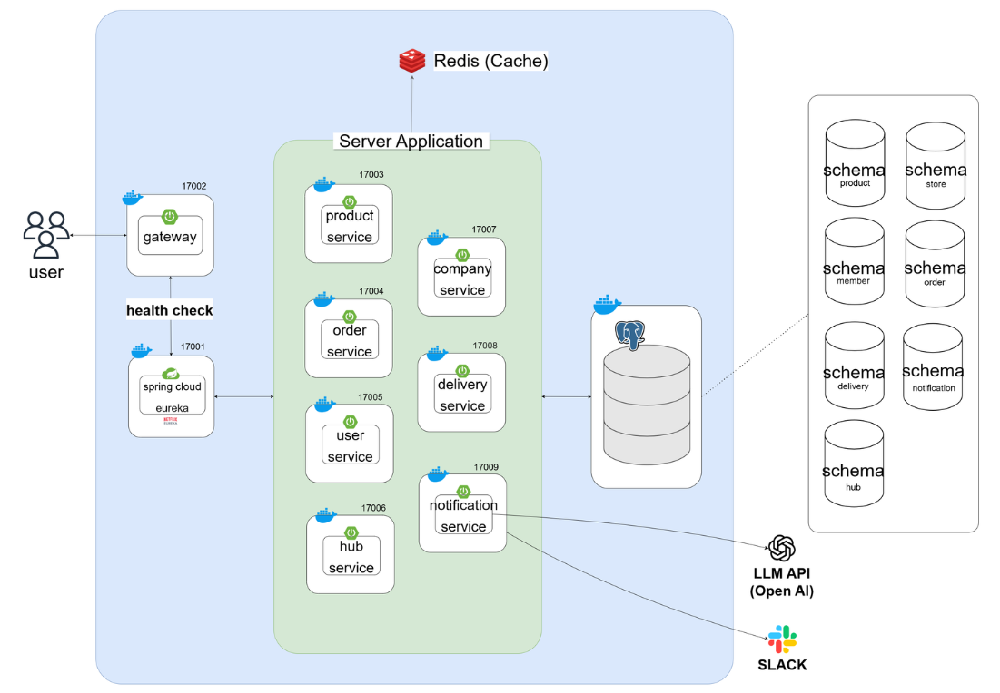
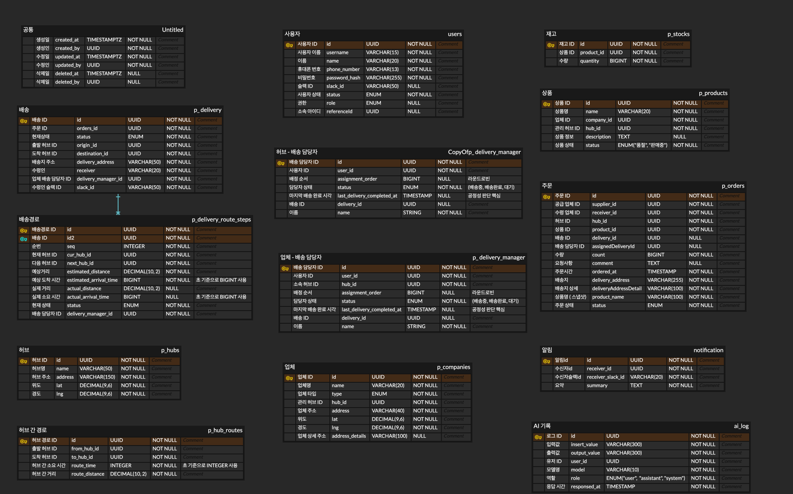

# Logistics Hub Platform

그래프 기반 허브 경로 탐색을 중심으로 한 MSA 물류 시스템

---

## 프로젝트 개요

본 시스템은 그래프 기반 경로 탐색과 MSA 아키텍처를 결합하여 복잡한 물류 흐름을 효율적으로 처리하는 물류 시스템입니다.

물류 시스템에서 허브 간 이동은 단순 CRUD가 아닌 **그래프 기반 경로 탐색 문제**로 확장됩니다.

본 프로젝트는 허브 간 경로를 효율적으로 관리하고, 최단 경로를 계산하여 배송 흐름을 최적화하는 것을 목표로 합니다.

또한 MSA 아키텍처를 기반으로 서비스 간 독립성과 확장성을 고려하여 설계되었습니다.

---

## 실행 방법

### 1. 환경 변수 설정

루트 디렉토리에 `.env` 파일을 생성하고 아래 값을 설정합니다.
```
POSTGRES_HOST=localhost
POSTGRES_PORT=5432
POSTGRES_DB=postgres
POSTGRES_USER=postgres
POSTGRES_PASSWORD=yourpassword

SPRING_DATA_REDIS_HOST=localhost
SPRING_DATA_REDIS_PORT=6379
SPRING_DATA_REDIS_PASSWORD=yourpassword
```

### 2. 인프라 실행 (Docker)

PostgreSQL 및 Redis를 Docker로 실행합니다.

```
docker-compose up -d
```

### 3. 서비스 실행 순서

MSA 환경에서는 서비스 간 의존성이 존재하므로 아래 순서로 실행합니다.
```
1. eureka-server
2. gateway
3. user-service
4. product-service
5. company-service
6. hub-service
7. order-service
8. delivery-service
9. notification-service
```

### 4. 접속 정보
```
Gateway       : http://localhost:17002
Eureka Server : http://localhost:17001/eureka
```

### 5. API 테스트 방법
- Swagger 또는 Postman을 활용하여 API 테스트
- 모든 요청은 Gateway를 통해 접근

---

## 물류 처리 흐름

본 시스템은 **수요업체 → 공급업체 → 허브 → 배송**으로 이어지는 흐름을 기반으로 동작합니다.

1. **수요업체 (Order Service)**
    - 상품 주문 생성

2. **공급업체 (Product / Company Service)**
    - 주문 및 재고 확인 후 상품 준비

3. **허브 (Hub Service)**
    - 허브 간 최적 경로 계산 (Dijkstra)
    - 물류 이동 경로 결정

4. **배송 (Delivery Service)**
    - 허브 간 이동 및 최종 배송
    - 배송 상태 관리 및 담당자 배정

**핵심**
- 서비스 간 흐름은 **MSA 구조로 분리**
- 허브 간 이동은 **그래프 기반 알고리즘으로 최적화**

---

## 팀 구성 및 역할

| 이름 | 역할                                         |
|------|--------------------------------------------|
| 송유진 | 사용자 인증 및 API Gateway 설계 및 구현 (User / Auth) |
| 김란미 | 상품 및 업체 도메인 설계 및 구현 (Product / Company)    |
| 장윤호 | 주문 도메인 설계 및 구현 (Order)                     |
| 김종표 | 허브 도메인 설계 및 경로 탐색 알고리즘 구현 (Hub)             |
| 신혜원 | 배송 도메인 설계 및 구현 (Delivery)                  |
| 남순식 | 배송 담당자 도메인 설계 및 구현 (Delivery Manager)      |

---

## 시스템 아키텍처

**MSA 구조를 기반으로 각 서비스는 독립적으로 배포되며,  
API Gateway를 통해 외부 요청을 단일 진입점으로 처리합니다.**

- API Gateway 기반 단일 진입점
- Eureka 기반 서비스 디스커버리
- Feign Client 기반 서비스 간 통신
- JWT 기반 인증 및 인가
- Redis 기반 캐싱 및 성능 최적화



> 각 서비스는 독립적으로 배포되며, Feign Client를 통해 필요한 데이터만 통신하도록 설계되었습니다.

### 서비스 구성

| 구분 | 서비스 | 설명 |
|------|--------|------|
| Infra | gateway | API Gateway (단일 진입점, 인증 필터 적용) |
| Infra | eureka-server | 서비스 디스커버리 |
| Domain | user-service | 사용자 관리 및 인증 |
| Domain | product-service | 상품 및 재고 관리 |
| Domain | company-service | 업체 정보 관리 |
| Domain | order-service | 주문 생성 및 상태 관리 |
| Domain | hub-service | 허브 및 경로 탐색 |
| Domain | delivery-service | 배송 및 배송 흐름 관리 |
| Domain | notification-service | 알림 및 외부 연동 (Slack 등) |

---

## 기술 스택

### Backend
- Java 17
- Spring Boot 3.5
- Spring Data JPA 
- QueryDSL

### MSA
- Spring Cloud 2025.0.1
- Eureka
- OpenFeign
- Spring Cloud Gateway (API Gateway)

### Database / Cache
- PostgreSQL (Multi Schema)
- Redis

### Infra
- Docker
- Docker Compose

### CI/CD
- GitHub Actions

---

## 주요 기능

### User & Auth

#### 문제 정의
사용자와 배송 담당자의 역할이 다양해지면서  
단순 role 기반 분기 처리로는 확장성이 떨어지는 문제가 존재

#### 해결 방법
- 사용자 역할을 유연하게 확장 가능한 구조로 설계
- 서비스 간 데이터 정합성 문제를 이벤트 기반으로 보완

#### 주요 기능
- JWT 기반 인증 / 인가
- API Gateway 인증 필터 적용
- Feign 요청 인증 정보 전파

---

### Product & Company

#### 문제 정의
상품과 재고는 밀접하지만  
재고는 빈번하게 변경되어 하나의 애그리거트로 관리 시 확장성이 저하됨

#### 해결 방법
- Product / Inventory 애그리거트 분리
- 이벤트 기반 상태 동기화

#### 주요 기능
- 상품 및 재고 관리
- 상품 생성 시 재고 초기화
- 재고 상태 기반 상품 상태 변경

---

### Order Service

#### 문제 정의
주문은 단순 저장이 아닌  
**분산 트랜잭션과 서비스 간 조율 문제**입니다.

- 재고/배송 연동 필요
- 서비스 장애 전파 문제
- 역할별 데이터 접근 제어 필요

#### 해결 방법
- Saga 패턴 기반 보상 트랜잭션 적용
- 스냅샷 패턴으로 외부 의존 최소화
- Specification 패턴으로 동적 조회 처리
- 상태 머신 기반 상태 전이 관리

#### 주요 기능
- 주문 생성 / 수정 / 취소
- 상태 기반 주문 관리
- 역할별 주문 조회
- 분산 트랜잭션 처리

---

### Hub Service

#### 문제 정의
허브 간 물류 이동은 단순 조회가 아니라  
**그래프 기반 경로 탐색 문제**입니다.

#### 해결 방법
- Hub(Node) / HubRoute(Edge) 모델링
- Dijkstra 알고리즘 적용
- 거리 → 시간 기반 가중치 적용 (실제 물류 환경 반영)
- Redis 캐싱 도입

#### 주요 기능
- 허브 CRUD (Soft Delete)
- 허브 간 경로 관리
- 최단 경로 탐색

#### 성능 개선
- Redis Cache Aside 패턴 적용
- 조회 시 DB 접근 최소화
- @Cacheable / @CacheEvict 기반 캐싱 전략 적용
```
기존: 약 300 ~ 400ms  
개선: 약 2 ~ 10ms

→ 최대 약 98% 응답 속도 개선
```
---

### Delivery Service

#### 문제 정의
배송은 단순 CRUD가 아닌  
**다단계 흐름과 상태 전이 관리 문제**입니다.

- 하나의 배송에 여러 경로 존재
- 단계별 담당자 자동 배정 필요
- 상태 전이 제어 필요

#### 해결 방법
- Delivery / DeliveryRoute 분리 (다단계 모델)
- 이벤트 기반 담당자 배정 (EDA)
- 도메인 내부 상태 전이 규칙 관리

#### 주요 기능
- 배송 생성 및 경로 자동 구성
- 배송 경로 순차 처리
- 담당자 자동 배정
- 상태 기반 배송 흐름 제어

---

### Delivery Manager

#### 문제 정의
배송 담당자 도메인은 사용자 및 배송 도메인과 강하게 결합되어  
의존성 증가 및 변경 영향 범위 확대 문제가 존재

#### 해결 방법
- 이벤트 기반 구조로 의존성 분리 (DIP 적용)
- 서비스 간 직접 참조 제거

#### 주요 기능
- 배송 담당자 생성 및 관리
- 배송 담당자 자동 배정 지원
- 사용자/배송 상태와 연동 처리

---

## ERD

본 시스템은 MSA 구조에 맞춰 도메인별로 분리된 데이터 모델을 가지며, 각 서비스는 독립적인 스키마를 사용합니다.

- 모든 엔티티는 UUID 기반으로 식별되며, 서비스 간 직접적인 FK 대신 참조 ID를 사용합니다.
- 주문(Order), 배송(Delivery), 허브(Hub), 상품(Product), 사용자(User) 등 주요 도메인이 분리되어 설계되었습니다.
- 배송은 Delivery와 DeliveryRouteStep으로 분리하여 다단계 이동 흐름을 표현합니다.
- 상품(Product)과 재고(Stock)는 별도의 애그리거트로 분리되어 이벤트 기반으로 동기화됩니다.
- 허브(Hub)와 허브 간 경로(HubRoute)는 그래프 구조(Node/Edge)로 모델링되어 최단 경로 탐색에 활용됩니다.



> 서비스 간 결합도를 낮추고, 확장성과 독립성을 확보하는 구조로 설계되었습니다.
---

## 설계 핵심

### 1. MSA 설계
- Feign 기반 서비스 간 통신
- Gateway + JWT 기반 인증/인가
- Eureka 기반 서비스 디스커버리

→ 서비스 간 결합도를 낮추고, 독립적인 배포 및 확장이 가능한 구조 설계

---

### 2. DDD 적용
- VO 객체 활용
- 도메인 내부에서 검증 및 로직 처리

→ 서비스 계층이 아닌 도메인 내부에서 비즈니스 규칙을 관리하여 응집도를 높이고 유지보수성을 향상

---

### 3. 그래프 기반 모델링
- Hub → Node
- HubRoute → Edge

→ 허브 간 물류 이동을 그래프 구조로 모델링하여 최단 경로 탐색 알고리즘(Dijkstra)을 적용할 수 있도록 설계

---

### 4. 결합도 최소화
- FK 대신 UUID 기반 참조
- 이벤트 기반 통신 적용 (일부 도메인)

→ 서비스 간 직접 의존을 제거하고 장애 전파를 최소화하여 유연한 확장이 가능한 구조 구현
